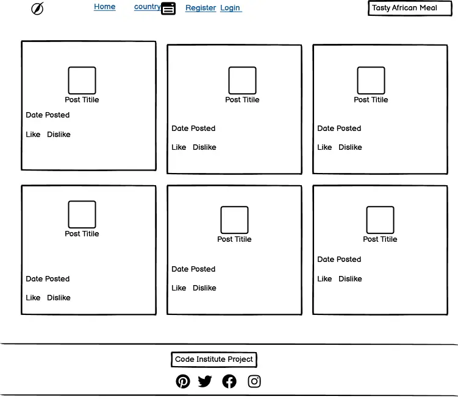
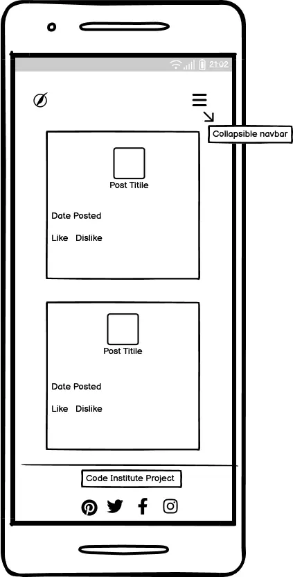
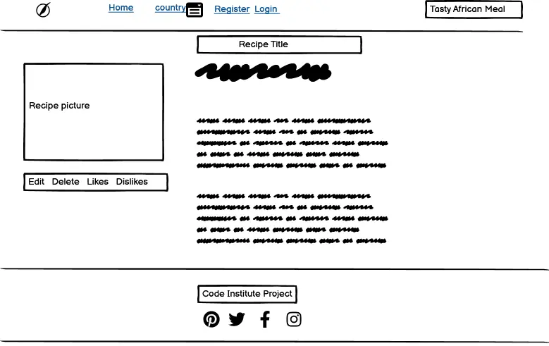
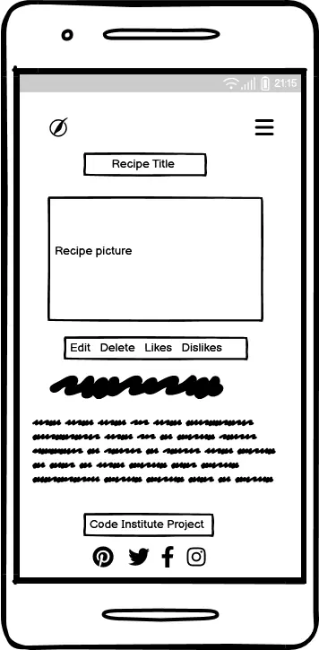
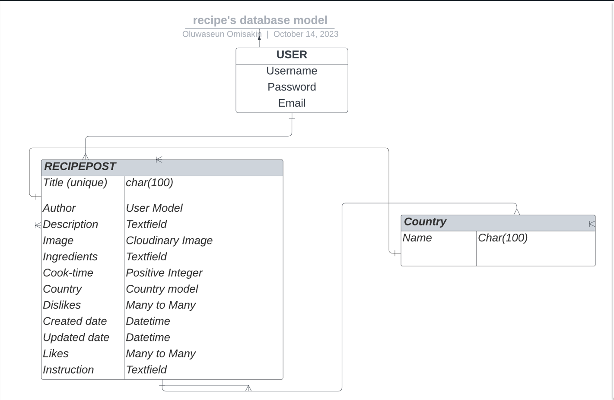

**Table of Contents:**
---
---
 * [Scope](#scope)  
 * [Background](#background)
 * [Target Audience](#target-audience)
 * [Wireframes](#wireframes)
    * [Wireframe 1](#wireframe-1-the-landing-page)
    * [Wireframe 2](#wireframe-2-the-recipe-detail-page)
* [User Stories](#user-stories)
    * [Admin User Story](#admin-user-story)
    * [General User User Story](#general-user-user-story)
    * [Unregistered users User Story](#unregistered-user-user-story)
    * [Registered users User Story](#registered-user-user-story)
* [Features](#features)
    * [Base Template](#base-template)
        * [Header and Navbar](#header-and-navbar)
        * [A Section for the Messages](#a-section-for-the-messages)
        * [Footer](#footer)
    * [Admin Section](#admin-section)
    * [Landing Page](#landing-page)
        * [Recipes](#recipes)
        * [Pagination](#pagination)
        * [Recipe by Country](#recipe-by-country)
    * [Details Page](#details-page)
    * [Add Recipe Page](#add-recipe-page)
    * [Update Recipe](#update-recipe)
    * [Delete Recipe](#delete-recipe)
    * [Share Post](#share-post)
    * [Countries Page](#countries-page)
    * [Edit User Page](#edit-user-page)
    * [Sign-In, Sign-Out, Sign-Up Pages](#sign-in-sign-out-sign-up-pages)
    * [Messages](#messages)
* [Database Model](#database-model)
     * [Recipe Class](#recipe-class)
         * [Recipe Class Method](#recipe-class-methods)
     * [Country Class](#country-class)
          * [Country Class Methods](#country-class-methods)
* [Recipes Views](#recipe-views)
     * [Landing Page View](#landing-page-view)
     * [Details Page View](#details-page-view)
     * [Likes and Dislike View](#likes-and-dislike-views)
     * [Add Recipe View](#add-recipe-view)
     * [Update Recipe View](#update-recipe-view)
     * [Delete Recipe View](#delete-recipe-view)
     * [Country View](#country-view)
     * [Edit User View](#edit-user-view)
     * [Change Password View](#change-password-view)
* [Recipe Forms](#recipe-forms)
     * [Recipe Form](#recipe-forms)
     * [Edit Profile Form](#edit-profile-form)
     * [Change Password Form](#change-password-form)
* [Mama'sKitchen Url](#mamaskitchen-url)
* [Mama'sKitchen Admin](#mamaskitchen-admin)
* [Future Features](#future-features)
* [Bugs](#bugs)
     * [Requirements File Bug](#requirements-file-bug)
     * [Add Recipe Page Bug](#add-recipe-page-bug)
     * [Country Page Bug](#country-page-bug)
     * [Update Recipe Image Input](#update-recipe-image-input)
     * [Likes and Dislike Message Bug](#likes-and-dislike-message-bug)
     * [Flash Messages](#flash-messages)
     * [Country Dropdown List](#country-dropdown-list)
     * [Heroku Deployment Bug](#heroku-deployment-bug)

---
# SCOPE
---

The scope of this project is to create a website using Python Django framework, tailored to showcase a diverse collection of authentic African recipes.

Key features will include:

**User Authentication:** The website will use the Django AllAuth library to enable user account creation and login functionality. Once registered and logged in, users gain access to the website's full suite of features.

**Recipe Management:** Registered users will have the capability to contribute their own recipes. Additionally, they can update their recipes over time to keep the content fresh and relevant.

**User Engagement:** Users can express their appreciation for recipes by liking them. They can also express their dislikes if a particular recipe does not align with their taste.

**Recipe Deletion:** Registered users will have the ability to delete their own recipes, providing them with control over their contributed content.

**Country-Based Navigation:** The website will offer a user-friendly way for visitors to search recipes from specific African countries. Users can either click on a country's name or utilize the dropdown menu featuring a list of african countries.

By implementing these features, 'Mama's Kitchen' aims to foster an engaging community for African food enthusiasts, where users can share, discover, and appreciate the rich heritage of African kitchen.

---
# Background
---

This project is inspired by the Code Institute 'I think there for I Blog' walkthrough project. As an African, I have always had a concern for African heritage which is not well preserved and  adequately transferred to the next generation.

I have taught of a way to preserve and promote the African culture especially providing a means whereby users of this platform can have access to different African traditional food from across the globe.

As it is well known that one of the factors for decline in active transfer ia the modernization and also immigration which has made different people forget or have little or no knowledge about their root.

This project seeks to be a store house for African Trditional meals where individuals can access different foods thereby promoting and preserving the heritage to generations.

---
# Target Audience
---

This project is tailored for a vibrant community of Africans, both at home and abroad, eager to delve deeper into the richness of African cuisine. The platform offers a delightful exploration of diverse African recipes. Whether an aspiring home chef or simply curious about the flavors of the continent.

---
# Wireframes
---

While conceiving the project the following were the wireframes were used to represent the home and details page.

All wireframes are made with Balsamiq

Link for the wireframe pictures can be found 

---

## Wireframe 1: The Landing page

### Desktop and Laptop

### Mobile

---

## Wireframe 2: The Recipe Detail page

### Desktop and Laptop

### Mobile

---

# User Stories

Below are the User Stories used to guide the development of Mama's Kitchen.

## Admin User Story

The Admin user User Stories were used as a guide to determine what Admin Superusers that have access to the Admin panel should be able to do.

As an Admin user I can..

Navigate to the admin sign-in page, so that I can sign in to the admin panel.

View all recipe posts submitted by users, so that I can view and edit posts if needed.

Filter and sort recipe posts easily, so that I can see all of the posts that needs to be approved.

Approve any number of selected recipes post so that they can be be visible on the site.

Delete any number of selected recipe, so that they no longer take up memory in the database especially the ones that are not on line with the platform ideas.

Make posts with rich text and images, so that I can improve the quality of posts.

Add a recipe post, so that I do not have to use the add post page on the front-end

Filter and sort all comments easily, so that I can see all recipes posts that fulfil certain criteria

---

## General User User Story

Generally, as a user I can ..

Immediately determine the purpose of the application on first visit, so that I can quickly decide whether its of interest or not.

Have a positive user experience irrespective of the means of access, so that I can access the application from enjoy the platform from any device

View all recipe posts so that I can choose one to read in detail.

Sort recipe posts by country name so that I can see only the recipe post of intrested countries.

If my search  by country returned no results, have a message displayed informing me of no posts related to my country search.

---
## Unregistered-user-User-Story

These user stories were outlined to determine specifically, what unregistered user should be able to do.

Sign-up and create an account, so that I can access the detailed functionality of the application.
Sign-in to that created account, so that I can access the detailed functionality of the application.

---

## Registered user User Story

These user stories helped to determine what registered users specifically should be able to do.

As a registered user I can ...

* Sign in to an already existing account, so that I can access the full functionality of the application.

* Edit recipe posts I created so that I can improve or modify the content.

* Delete recipe posts I created so that I know that I have the control of the content I created.

* Change the password for that account, so that it becomes more memorable.

* Sign-out easily, when already signed-in, so that I can be sure that my session was closed securely.

* Have my sign-in status reflected back to me, so that I can be sure that I have signed-in.

* Add a recipe post easily so that I can share food recipe on the website.

* Apply rich text formatting to the content of my recipe, so that I can better express myself and provide additional structure to my recipe.

* Upload an image to my recipe, so that I can show other users what the recipe looks like.

* If there is no recipe when searching by countrry, have that reflected back to me so that I know that there is no recipe for the selected country.

* Allow for confirmation of delete recipe befor deletion, so that I cannot accidentally delete any recipe post.

* Be alerted when I have posted a recipe, so that I can be assured that I have submitted the recipe.

* Be informed when I have successfully signed in, so that I can be assured that I have submitted the right details.

* Be informed when I have updated a recipe, so that I can be assured that I have updated the recipe.

* Be informed when I have deleted a recipe, so that I can be assured that I have deleted the recipe.

* When viewing a recipe detail, like the page , so that I can express my thoughts of the recipe.

* When viewing a recipe detail, dislike the page , so that I can express my thoughts of the recipe.

---
# Features

---
This section discusses the features and pages of the project 'Mama's Kitchen', the design choices made, discussion of the HTML and CSS codes. Where appropriate, the views and forms used to render those pages are also discussed.

---

## Base Template

Mama's Kitchen uses a single base template file extended to every other page, this is to provide a consistent user experience and promote uniformity across the website. Codes from the other templates are injected in=between the center element ({insert block content} & {end block content}) to relay the specificity of each page.
The base template is made up of the following;

### Header and Navbar

The navbar provides navigation to other pages of Mama's Kitchen. The navbar was created using a standard Bootstrap navbar and its responsive on different screen sizes. Each list item in the navbar is a link that changes color when hovered notifying user of mouse movement over the link.
Active pages are styled with custom CSS by a background color, border radius of 10px with black text. This was included to inform user about the page they are currently on.

All users have access to the default landing page (index page) by clicking either the bolded Mama'sKitchen icon or the Home Link. 
All users can search recipes by countries using the dropdown on the country link or clicking on their preferred country name on each recipe. A click on the country name filters the database by the recipe of the country, if there is no recipe for the country, the user is informed, more details will be discussed in the 'countries page' section.

If the user is signed out or has not yet created an account, navigation options after the above are either Log-in to an existing account or Register a new account. A user may create an account by clicking on the Sign Up link, or Sign in to an existing account by clicking on the Sign In link.

If the user is signed-in, navigation options are to either Sign-out or Add a new Recipe. The user may click on the Add Recipe link to be directed to a page where they may create and upload a recipe of choice.

On the right end of the navbar, unregistered users are presented with the statement 'Tasty African Recipe' while registered signed in users are presented with the caption 'Signed in as <username>'. This section  has two functions; first, it identifies the specific logged in user by displaying their name. The username also acts as a link where users can edit their profile information.

### A section for the messages
Messages if available are relayed to the users here. This message can be as a result of actions like login, logout, updating a profile, submitting a recipe. They all assure the user of the completion of their actions.

### Footer 
Links to various social media platforms are featured here with a copyright caption.

---

## Admin Section 

The project Mama'sKitchen has an admin section accessible only to its superusers. The admin section is displayed in a list for easy view by the admin, in the search field, recipes can be searches by recipe title, cook time and country. Also, the list can be filtered by date created, post approved and country, all this were included to ease the admin duties. There is also a section where the admin is set to manage the country list. The admin can view the list of countries from here.
Once the section is accessed, superusers may:

+ Create recipes to add to the page.
+ View the list of all submitted recipes.
+ Update and delete any submitted recipes.
+ Approve a recipe post so that it will be displayed on the main application.
+ View the list of all country names.
+ Update and delete countries when needed.
+ View a list of all authenticated users.
+ Delete any user.
+ Update any user information.
+ Change status of users to staff or superusers.

---

## Landing Page
---

This is the template rendered to the users when visiting the deployed site (Mama'sKitchen). The landing page is rendered from templates/index.html using the RecipeView view.
This view inherits from the Django [ListView](https://docs.djangoproject.com/en/4.2/ref/class-based-views/generic-display/) class. It uses the model Recipe and queries the database for approved posts. It paginates by 6 recipes per page allowing users navugatre to other page to view more recipes.
In order to provide additional context-data a function was defined to return the url_name and the country list as part of the rendered template. 

Landing page screenshot:

### Recipes

Each recipe card presents a brief overview of a particular recipe. Allowing thw user to view the image, local name, post author, country, likes and dislikes, date posted. A user click on the local name directs the user to a page containing more details (cook-time, instructions, ingredients) about the recipe.

The details page with its view is discussed below.

Recipe Screenshot:

### Pagination

The landing page is set to display recipes in batches of 6. Other recipes are paginated. The pagination allows users  to move in a variety of ways that intrest the user. Users can choose to move to the first page to view the first 6 recipes, move to the previous page from where they are currently on, move to the next page from where they are currently on, move to the last page of available recipes. By clicking on the button **First**, **Previous**, **Next**, **Last** respectively.

Users can access any particular pagination page by clicking on the appropriate numbered square. If any of the first, last, previous or last options are not available, then the button still displays, but is greyed-out and has no active href attribute. This was implemented to provide a consistent style as the user navigates the recipes paginated pages.

Including the pagination will help users to have a smooth scroll through to different pages of the site.

Pagination bar:

### Recipe by Country

Due to the nature of the project and its targets, I initially considered allowing users to filter the recipes available by country name. Users can access this function by either clicking on their desired country name on each post or by using the country dropdown in the navbar to select their choiced country.

If there are no recipe posted for such country, users are given a feedback informing them of no recipe posted for their country of choice. Users are then ebcouraged to add recipe for such country.

**Dropdown picture of Afrcican Countries:**

---

## Details Page

To promote the use of the site among users, all users are allowed access to the details page.The details page is used to display all about a single recipe that is clicked. It is rendered using the details template and the **RecipeDetails** view. The details page is styled mostly with bootstrap and some vanilla css. It features the recipe picture, title(recipe localname), number of likes and dislikes, instructions, ingredients, cook time.
The details page restricts some of its features, it displays the edit and delete button for recipe author and prevent non-authors access to it, it also allows authenticated users access to like and dislike function for each recipe.
A signed-in user and author of a recipe can edit or delete his recipe post from here.
The page also contains a placeholder image for posts made without an image this is to allow recipe in which its author maight not have the picture as at when posting.

Additionally, at the end of the recipe description is the back button that directs the user back to the default landing page providing an alternative to the user's browser back button.

**Screenshot of recipe details page:**

---

## Add Recipe Page

The add recipe page is rendered using the addrecipe template and the AddRecipe view. The AddRecipe class inherits from the class CreateView. It allows users to submit new recipe to be posted to the platform. 

The addrecipe page allows a user to write and submit a recipe of choice specifying the country it belongs. Submitting the recipe is done with a form and submitted. The user must enter all of the necessary information about the recipe like the title, ingredients required, instructions,  cook time. The user has to choose from the dropdown provided the country, a placeholder image is used if the user fails to provide a recipe image as I considered some users might not have the recipe picture but have the recipe description.
Recipe posts submitted needs to be approved by an administrator before it can be updated on the page. On successfull submission of recipe, the user is assured of the successful submission of the recipe and an assurance that its awaiting approval from an administrator.
Success message is relayed to the users using the imported class based view[SuccessMessageMixin](https://tech.serhatteker.com/post/2020-11/show-success-message-in-cbv-django/). 
Recipe posts needs to be approved to prevent unwanted posts from the platform.

**Screenshot of add recipe page:**

---

## Update Recipe Post

The update recipe page is rendered using the updaterecipe template and the UpdateRecipe view. 
Only authenticated users have access to the update recipe page, I added a link to direct unauthenticated users to the signup page in case they try to access this page.
To render the page, it inherits from the class based view [UpdateView](https://docs.djangoproject.com/en/4.2/ref/class-based-views/generic-editing/). It uses the model Recipe and the form RecipeForm class. Users get a feedback of successful recipe post edit using the SuccessMessageMixin to generate the message contained in the success_message variable as contained in the class definition.
To update a recipe post, the form field are pre-filled once the user click the specific recipe to update, this is done via the specific primary key of each post. The users can then update the needed field.
Only recipe post authors can update their recipe to prevent abuse of the update function since updating does not require permission from the administrator.

Screenshots of update recipe page:

---

## Delete Recipe

The delete recipe page is rendered using the deleterecipe template and the DeleteReview view. The view inherits from the class based view [Deleteview](https://docs.djangoproject.com/en/4.2/ref/class-based-views/generic-editing/). It uses the model Recipe. Upon successful deletion, it reverts back to the home page.

A simple template page that allows a user to delete a particular recipe. Rather than allowing the recipe posts deleted immediately after the user clicks on the delete, I allowed the user to choose weather to continue with the deletion or stop the process. Once deleted, the user is redirected back to the homepage and a message is relayed confirming successful deletion from the database.

To delete a recipe post, only the author is allowed to access the delete function of a particuler recipe post, non-authors of the posts are informed that they cannot delete any post with a link to go back to the home page. Also unauthorized users are informed that they are not allowed to delete any posts and can signup using the link to register.

**Screenshot of delete page**

---
## Share Post 

While building this project, I thought about adding a feature to allow users share recipe post. This can further promote the awareness for this site and also help to reach more audience with the african recipes. Using the [social share](https://pypi.org/project/django-social-share/) documentation on django and a bootstrap dropdown, I was able to include a share post feature on twitter telegram and whatsapp. I would have loved to include facebook but it was said in the documentation that facebook no longer supports this feature.

**Share post feature**

---

## Countries Page
This page presents to users a list of recipes available for their country of choice. Users can choose countries either by using the country dropdown as shown in the **"recipes by countries"** section or by clicking on the country name in each post.
The page is rendered using the countries template and the CountryView view. The view retrieves country object from the country model and gets all recipe that matches the query from the the recipe model. It renders the countries template with the requested recipes.

Each post is quite similar in display to the landing page but it does not have the country names specified on each post anymore as the recipe displayed belong to the same country referred to in the subject header.

**Screenshot of the Country Page**

---

## Edit User Page

The page is rendered using the edit_profile template and the EditUserView. Once signed in, users can click on their name on the right corner of the navbar to be taken to the edit_profile page. Users can then update whatever user detail they want to change. 

Once updated, users are redirected back home and a message is popped onto the screen confirming successful update of the user's profile.

**Screenshot of Profile Update Page**

---

## Sign In, Sign Out, Sign Up Pages

These are modified versions of the standard AllAuth templates that can be copied over from the site-packages directory with the cp -r ../.pip-modules/lib/python3.8/site-packages/allauth/templates/* ./templates command. Its modification include extending mama's kitchen base template and adding some bootstrap classes.

**Screenshot of Sign In Page**

**Screenshot of Sign Out Page**

**Screenshot of Sign Up Page**

---

## Messages

This was included to give the user a form of feedback for their actions. Users get a message when they successfully sign-in, sign-out, add a recipe post, delete a recipe post, change password, update their profile information.

**Samples of Messages to Users**

---
# Database Model

This section shows a representation of user structure and the database used in the buildup of Mama'sKitchen project. Two models were made representing the Recipe and Country.

## Recipe Class

The is used as a template to add in different recipes, users and admin can add post using this model.

|Field | Details|
|---   | --------
|Title | CharField with maximum length set to 150 Each title is set be be unique|
| Author| This takes the creators name, It is a foreign key linked to Users model. Deleting the author will cause all posts in the author's name to be deleted as well (on_delete=models.CASCADE)|
|Instructions| This field takes text(TextField()) describing the cooking process.|
|Ingredients| This field takes text(TextField()) describing the cooking materials.|
|Recipe Image| A cloudinary image field. If users fail to provide an image it is set to the default placeholder.|
|Cook Time| Represents the time required. It is set to PositiveIntegerField()|
|Country| A foreign key which represents recipe country. If not provided, the default is applied.|
|Likes| ManyToManyField, since many users can like many posts.|
|Dislikes|ManyToManyField, since many users can dislike many posts.|
|Date Created | Sets the date the post is made. It is set to auto_now_add=True so that exact time of creating the post can be recorded.|
| Date Updated | Sets the date any update is made on the post.|
|Post Approved |A BooleanField that default to 'False'. Can be changed by admin to make post appear on the site.|

### Recipe Class Methods
Recipe class contains some methods; 

* The first been the Meta class which returns the ordering of the recipes.
* A string method returning the recipe title for easy identification of the recipe.
* The number_of_likes() method returns the likes coount.
* The number_of_dislikes() method returns the dislike count.
* The get_absolute_url() method directs the url back home.
* The save() method overide function to date of post update.

## Country Class
This is majorly added by the superuser used to populate the dropdown choice on the navbar, it is also used as a reference for users to access recipes of different countries.

|Field|Details
|---|---|
|Name|A CharField set to maximum length of 150, each country name is unique.|

Primary key is used in referencing posts and countries throughout the project. It is unique and is added automatically by django to each post created.

Images used are cloudinary images linked to my cloudinary account.

Included with the instruction and ingredients field is the django_summernote which adds rich text editor to the fields.

The likes and dislikes field allow user a form of expression on different recipes thereby communicating their views to others.

### Country Class Methods
Country class contains the following methods;

* A Meta class which returns the ordering by name of the countries.
* A string method which returns the name of the country.
 
---

# Recipe Views
This section explains different view used to render pages to users.

## Landing Page View

RecipeView class renders the index.html page. It inherits from the django class ListView. It defines a set of query to filter objects by their approval status and orders them by descending date created. It paginates post by 6  and adds url data and country list to the returned context allowing me access to the url name and list of countries.

## Details Page View
RecipeDetails is used to display more details on a specific post to the users. Defined using a function based class. It gets the specific object query from the model and returns the content containing the full recipe and the liked and also filters if like or dislike value exists. It renders the page using the 'details.html'.

## Likes and Dislike Views
This views handles the like and dislike feature of the app. Very similar but a little different. They both handle post request from the user and toggles the buttons to either add or remove the user. It uses an HttpResponseRedirect to redirect the user back to the details page.

## Add Recipe View
This view handles adding recipe post to the site. It uses the Recipe model and inherits from the django [CreateView class](https://docs.djangoproject.com/en/4.2/ref/class-based-views/generic-editing/). It displays a form using the form class RecipeForm for creating a new recipe and allows users to submit a new recipe for approval by the admin. It renders the template 'addrecipe.html' and returns the url back home once successfully submitted.

It contains a method that displays message to user confirming successful submission of recipe to users.Also, it returns the url data as part of the context for access to the url name.

## Update Recipe View
This view handles recipe recipe post update, it inherits from django [class UpdateView](https://docs.djangoproject.com/en/4.2/ref/class-based-views/generic-editing/) and displays a form using the Recipe model and the RecipeForm to update a selected recipe post. It uses [SuccessMessageMixin](https://stackoverflow.com/questions/29521871/why-success-message-messagemixin-is-called-after-form-valid-shouldnt-it-be) to alert users successful recipe post update.

## Delete Recipe View

This view allows authors of a recipe post to delete the recipe if neccessary. It inherits from django class [DeleteView ](https://docs.djangoproject.com/en/4.2/ref/class-based-views/generic-editing/). It renders a deleterecipe form (deleterecipe.html) allowing user to confirm delete action and returnd the user back home.

It uses [SuccessMessageMixin](https://stackoverflow.com/questions/47636968/django-messages-for-a-successfully-delete-add-or-edit-item) overwritten to return a successful deletion message to users.

## Country View

A function based view that accepts user's request and choice. It retrieves the request object from the country model and renders the countries template with the requested countries.
Due to issues of case and space, I have used Q search for the country's name because to allows for a broader search in country's name in cases of case or space in country name.
The view is set to return a 404 page if the query is not available.

## Edit User View

This view allows users to edit their profile details, it inherits from the django class UpdateView.It uses the EditProfile form to render the edit_profile page. It redirects the users back home.
Once successful, users are informed of the successful edit of their profile using the SuccessMessageMixins.

It has a method that returns the current logged in user's details.

## Change Password View

This view allows users to change password details inheriting from django PasswordChangeView, it uses the ChangePasswordForm to change the user's details.

    
# Recipe Forms
The recipe forms file contains three form classes - RecipeForm, EditProfileForm and ChangePasswordForm. The forms are defined to specifically control which fields to be displayed. Also to apply the Bootstrap form-control class to makes the forms nicer to use. Widgets variable was used to apply the form-control class, widgets was also used to get the django-summernote Rich Text Editor working by way of the SummernoteWidget for some of the fields. 

## RecipeForm
RecipeForm class uses the model Recipe inherits from django forms.ModelForm and states the fields to be displayed. It uses widgets to customise the appearance and behavior of form fields defined.

SummernoteWidget is applied to two of the fields; instruction and ingredients to allow users access to different stylings of fonts.

It has an _init_ method that defines the form layout and styles using FormHelper and Layout, this form will be rendered in the template with the specified fields and styles, making it easier to create consistent and visually appealing form.

## Edit Profile Form
This form uses the model User and inherits from django class [UserChangeForm](https://docs.djangoproject.com/en/1.8/_modules/django/contrib/auth/forms/). It allows users to edit choice fields in the user's detail. Styled with bootstrap for a more appealing view. It defines fields to be displayed to users.

## Change Password Form
This form uses the model User and inherits django's class [PasswordChangeForm](https://docs.djangoproject.com/en/1.8/_modules/django/contrib/auth/forms/). It allows users change their password by entering their old password and confirming a new one. For each field, it uses a Charfield and sets the maximum length of password to 100 including widget to add attributes for styling.

# Mama'sKitchen Url

The urls file holds the urlpatterns for Mama'skitchen app. The paths renders different pages discussed above. The first been the landing page, recipe details page, add recipe page, update recipe page, delete recipe page, countries page, editprofile, change password. Also the likes and dislike view . 

As previously mentioned, recipes are listed by their primary key, hence for paths that deal with a specific item; <int:pk> is used instead of <slug:slug> as in the walkthrough project.

# Mama'sKitchen Admin

The admin file controls the layout of, and actions available in, the Django admin panel. There are two classes - RecipeAdmin and CountryAdmin. RecipeAdmin classe extend the SummernoteModelAdmin class in its ingredients and instructions field.

RecipeAdmin class has list_filter, search_fields, list_display, and summernote_fields. 

The list_display control variable within the class allow an administrator to quickly see some important meta-data about a recipe - id, title, post approval status and date of post creation.

The search_field allow access to recipe using the quick search feature within it - post title, cook time, country.

The list_filter allow easy filtering of recipes by date created, post approval state, and country 
   

CountryAdmin class specifies how the country view panel is displayed. It has list_display which allows the administrator to have a view of the country list with its id.

---

# Future Features

This section lists all features I will like implement to improve the project and futher increase my knowledge of the process. Some were not due to time constraints and others to a lack of skill.

Add an homepage banner display for non-authenticated user.

Add comments section to promote communication on the platform.

Display number of approved comments attached to each review on the index and details pages.

Extend user model to include profile picture and more information about the user.

Allow accessibility to user's profile but not edit if not the real profile user.

Add higher-level AllAuth functionality - social media sign in, password complexity, confirmation emails, etc

Modify UserSignUpForm in user/forms.py to include additional first_name and last_name fields

Allow users access to a list of his unapproved posts.

---

# Bugs

## Requirements file bug

* When trying to deploy the first Mama'skitchen blank site, the deployment fail but after lots of investigation I noticed that I omitted the 's' after the requirement hence the reason for a failed deployment.
    * Adding 's' to the file name and trying redeploying fixed this.

## Add Recipe Page Bug

* When adding a new recipe from the user's side, I always try to make some adjustment on the admin section before approving. The homepage display always display html and css code.
    * Gemma of tutor support enlightened me on this and encouraged me to add summernote editor to the user's section.

## Country Page Bug

* While trying tomake each country a link to access different recipes, I got error with countries with space and casing.
    * Importing Q to use for advance search fixed this.

* Border around country page stoped on the first column.
    * Replacing the border with 'hr' below the country header fixed this.

## Update Recipe Image Input

* When testing, I realised that the default word next to 'No file chosen' on the image field was overflowing its box.
    * Inspecting with devtool and adding font size 10px to it fix this. I also decided to make the lettering bold for clear visibility.

## Flash Messages

* My mentor noted that the initial time of 2000ms delay on the flash message before disapppearance seem too small.
   * Adding 500ms more delay fixed this. 

## Likes and Dislike Message Bug

* I noticed that after setting up the like and dislike feature, a user can add like to a recipe and at the same time add dislike to it.
    * Adding an if statement to check and remove one if the other is already present fixed this.

    
## Country Dropdown List
* I noticed the country list was too long (as I have many afrrican countries to add), which to me reduces good user experience and it will be covering too much of the page content.
   * Adding max-height and overflow property to the dropdown menu style fixed this, so I am ablt to add in more countries without fear of covering up the landing page.

## Home Page Validation Bug

* While validating the homepage, I got the error of "Multiple use of id values" on the template.
    * The thought of adding a unique number at the end of the id values with the recipe primary keys fixed this. 

## Heroku Deployment Bug

* while deploying with contents as I did not deploy the empty project as advised by a senior colleague, I got this deployment error ***"KeyError: 'etag'
 !     Error while running '$ python manage.py collectstatic --noinput'."***. 
     *