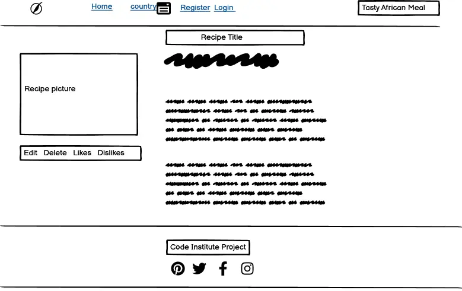
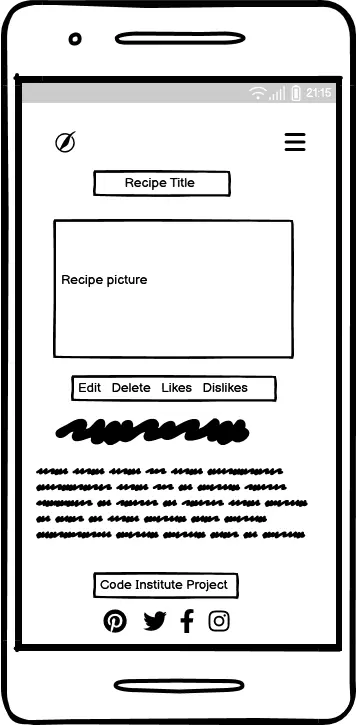

**Table of Contents:**
---
---
 * [Scope](#scope)  
 * [Background](#background)
 * [Target Audience](#target-audience)
 * [Wireframes](#wireframes)
    * [Wireframe 1](#wireframe-1-the-landing-page)
    * [Wireframe 2](#wireframe-2-the-recipe-detail-page)
* [User Stories](#user-stories)
    * [Admin User Story](#admin-user-story)
    * [General User User Story](#general-user-user-story)
    * [Unregistered users User Story](#unregistered-user-user-story)
    * [Registered users User Story](#registered-user-user-story)

---
# SCOPE
---

The scope of this project is to create a website using Python Django framework, tailored to showcase a diverse collection of authentic African recipes.

Key features will include:

**User Authentication:** The website will use the Django AllAuth library to enable user account creation and login functionality. Once registered and logged in, users gain access to the website's full suite of features.

**Recipe Management:** Registered users will have the capability to contribute their own recipes. Additionally, they can update their recipes over time to keep the content fresh and relevant.

**User Engagement:** Users can express their appreciation for recipes by liking them. They can also express their dislikes if a particular recipe does not align with their taste.

**Recipe Deletion:** Registered users will have the ability to delete their own recipes, providing them with control over their contributed content.

**Country-Based Navigation:** The website will offer a user-friendly way for visitors to search recipes from specific African countries. Users can either click on a country's name or utilize the dropdown menu featuring a list of african countries.

By implementing these features, 'Mama's Kitchen' aims to foster an engaging community for African food enthusiasts, where users can share, discover, and appreciate the rich heritage of African kitchen.

---
# Background
---

This project is inspired by the Code Institute 'I think there for I Blog' walkthrough project. As an African, I have always had a concern for African heritage which is not well preserved and  adequately transferred to the next generation.

I have taught of a way to preserve and promote the African culture especially providing a means whereby users of this platform can have access to different African traditional food from across the globe.

As it is well known that one of the factors for decline in active transfer ia the modernization and also immigration which has made different people forget or have little or no knowledge about their root.

This project seeks to be a store house for African Trditional meals where individuals can access different foods thereby promoting and preserving the heritage to generations.

---
# Target Audience
---

This project is tailored for a vibrant community of Africans, both at home and abroad, eager to delve deeper into the richness of African cuisine. The platform offers a delightful exploration of diverse African recipes. Whether an aspiring home chef or simply curious about the flavors of the continent.

---
# Wireframes
---

While conceiving the project the following were the wireframes were used to represent the home and details page.

All wireframes are made with Balsamiq

Link for the wireframe pictures can be found 

---

## Wireframe 1: The Landing page

### Desktop and Laptop

### Mobile

---

## Wireframe 2: The Recipe Detail page

### Desktop and Laptop

### Mobile

---

# User Stories

Below are the User Stories used to guide the development of Mama's Kitchen.

## Admin User Story

The Admin user User Stories were used as a guide to determine what Admin Superusers that have access to the Admin panel should be able to do.

As an Admin user I can..

Navigate to the admin sign-in page, so that I can sign in to the admin panel.

View all recipe posts submitted by users, so that I can view and edit posts if needed.

Filter and sort recipe posts easily, so that I can see all of the posts that needs to be approved.

Approve any number of selected recipes post so that they can be be visible on the site.

Delete any number of selected recipe, so that they no longer take up memory in the database especially the ones that are not on line with the platform ideas.

Make posts with rich text and images, so that I can improve the quality of posts.

Add a recipe post, so that I do not have to use the add post page on the front-end

Filter and sort all comments easily, so that I can see all recipes posts that fulfil certain criteria

---

## General User User Story

Generally, as a user I can ..

Immediately determine the purpose of the application on first visit, so that I can quickly decide whether its of interest or not.

Have a positive user experience irrespective of the means of access, so that I can access the application from enjoy the platform from any device

View all recipe posts so that I can choose one to read in detail.

Sort recipe posts by country name so that I can see only the recipe post of intrested countries.

If my search  by country returned no results, have a message displayed informing me of no posts related to my country search.

---
## Unregistered-user-User-Story

These user stories were outlined to determine specifically, what unregistered user should be able to do.

Sign-up and create an account, so that I can access the detailed functionality of the application.
Sign-in to that created account, so that I can access the detailed functionality of the application.

---

## Registered user User Story

These user stories helped to determine what registered users specifically should be able to do.

As a registered user I can ...

* Sign in to an already existing account, so that I can access the full functionality of the application.

* Edit recipe posts I created so that I can improve or modify the content.

* Delete recipe posts I created so that I know that I have the control of the content I created.

* Change the password for that account, so that it becomes more memorable.

* Sign-out easily, when already signed-in, so that I can be sure that my session was closed securely.

* Have my sign-in status reflected back to me, so that I can be sure that I have signed-in.

* Add a recipe post easily so that I can share food recipe on the website.

* Apply rich text formatting to the content of my recipe, so that I can better express myself and provide additional structure to my recipe.

* Upload an image to my recipe, so that I can show other users what the recipe looks like.

* If there is no recipe when searching by countrry, have that reflected back to me so that I know that there is no recipe for the selected country.

* Allow for confirmation of delete recipe befor deletion, so that I cannot accidentally delete any recipe post.

* Be alerted when I have posted a recipe, so that I can be assured that I have submitted the recipe.

* Be informed when I have successfully signed in, so that I can be assured that I have submitted the right details.

* Be informed when I have updated a recipe, so that I can be assured that I have updated the recipe.

* Be informed when I have deleted a recipe, so that I can be assured that I have deleted the recipe.

* When viewing a recipe detail, like the page , so that I can express my thoughts of the recipe.

* When viewing a recipe detail, dislike the page , so that I can express my thoughts of the recipe.
